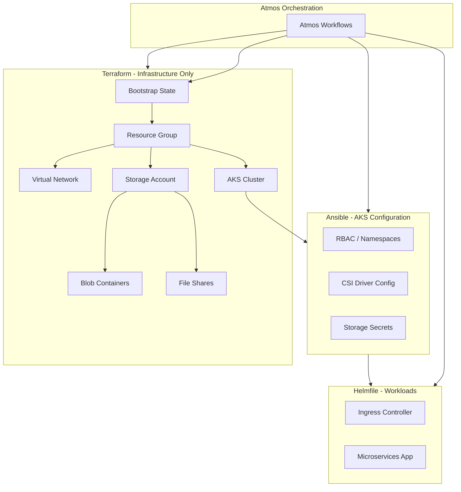

# Production-Ready AKS with Atmos, Azure Verified Modules, and Microservices

## Architecture Overview



## 1. Project Structure

```
aws-terraform-atmos/
├── atmos.yaml                    # Atmos CLI config
├── stacks/
│   ├── orgs/
│   │   └── homelab/
│   │       └── _defaults.yaml   # Org-wide defaults
│   ├── catalog/
│   │   ├── terraform/            # Reusable Terraform catalogs
│   │   └── helmfile/
│   └── deploy/
│       ├── dev/
│       │   └── aks.yaml
│       └── prod/
│           └── aks.yaml
├── components/
│   ├── terraform/
│   │   ├── bootstrap/            # State backend bootstrap
│   │   ├── resource-group/
│   │   ├── network/
│   │   ├── aks/
│   │   └── storage/
│   ├── ansible/
│   │   └── aks-config/           # Namespaces, CSI, RBAC
│   └── helmfile/
│       ├── ingress/
│       └── demo-app/
├── scripts/
│   └── bootstrap-state.sh       # One-time state bootstrap
└── apps/
    └── demo-microservices/       # Sample app (API, worker, Redis)
```

## 2. Terraform State Bootstrap

**Approach:** Create Azure Storage Account and container for Terraform state **outside** Terraform (or via a one-time bootstrap component) so the main state is not stored in a resource it manages.

- **Script:** `scripts/bootstrap-state.sh` using Azure CLI:
  - Create resource group `tfstate-<org>-<region>`
  - Create storage account with blob encryption
  - Create container `tfstate`
  - Enable versioning and soft delete (optional, for recovery)
- **Atmos backend config** in stacks:

```yaml
terraform:
  backend_type: azurerm
  backend:
    azurerm:
      resource_group_name: "tfstate-homelab-{{ .region }}"
      storage_account_name: "<from bootstrap output>"
      container_name: tfstate
      key: "{{ .tenant }}-{{ .environment }}-{{ .stage }}-{{ .component }}.tfstate"
```

- Bootstrap runs once; all other Terraform components use this backend.

## 3. Terraform Components (AVM + Cloud Posse Modules)

### 3.1 Cloud Posse terraform-null-label (Naming and Tags)

Use [cloudposse/label/null](https://github.com/cloudposse/terraform-null-label) in every Terraform component for consistent naming and tagging. It is provider-agnostic and aligns with Atmos (both from Cloud Posse).

**Stack vars passed from Atmos** (e.g., in `stacks/orgs/homelab/_defaults.yaml`):

```yaml
vars:
  namespace: homelab
  tenant: null
  environment: "{{ .environment }}"   # e.g., ue2 for us-east-2
  stage: "{{ .stage }}"               # dev, prod
  name: "{{ .component }}"            # resource-group, aks, storage
  delimiter: "-"
  label_order: ["namespace", "environment", "stage", "name", "attributes"]
  regex_replace_chars: "/[^a-zA-Z0-9-]/"   # Azure-friendly (no underscores in some resources)
```

**Per-component usage:**

```hcl
module "label" {
  source  = "cloudposse/label/null"
  version = "~> 0.25"

  namespace   = var.namespace
  environment = var.environment
  stage       = var.stage
  name        = var.name
  attributes  = var.attributes
  delimiter   = var.delimiter
  tags        = var.tags
}

# Azure storage account: 3-24 chars, lowercase, alphanumeric only
module "storage_label" {
  source  = "cloudposse/label/null"
  version = "~> 0.25"

  namespace        = var.namespace
  environment      = var.environment
  stage            = var.stage
  name             = "st"
  attributes       = ["tfstate"]
  id_length_limit  = 24
  label_value_case = "lower"
  regex_replace_chars = "/[^a-z0-9]/"
}
```

**Benefits:**

- Consistent IDs: `homelab-ue2-prod-aks`, `homelab-ue2-prod-st-tfstate`
- Tags propagated to all resources (Namespace, Environment, Stage, Name)
- Context object chaining between modules
- Azure constraints: use `id_length_limit` and `regex_replace_chars` for storage account names

### 3.2 AVM Modules

| Component        | AVM Module                                                      | Purpose                                              |
| ---------------- | --------------------------------------------------------------- | ---------------------------------------------------- |
| `resource-group` | `Azure/avm-res-resourcegroup-resourcegroup/azurerm`             | Resource group for all resources                     |
| `network`        | `Azure/avm-res-network-virtualnetwork/azurerm` + subnet modules | VNet, subnets for AKS                                |
| `aks`            | `Azure/avm-res-containerservice-managedcluster/azurerm`         | Production AKS cluster                               |
| `storage`        | `Azure/avm-res-storage-storageaccount/azurerm`                  | Storage account with blob containers and file shares |

**Integration:** Each component instantiates `terraform-null-label` and passes `module.label.id` and `module.label.tags` to the AVM module inputs (e.g., `name`, `tags`).

**Key AKS settings (production-ready):**

- Azure Monitor / Log Analytics
- RBAC enabled
- System + user node pools
- CSI drivers enabled by default (Azure Files, Blob)

**Storage module:** Create storage account with:

- Blob container(s) for app data
- File share(s) for shared/stateful workloads
- Private endpoint (optional, for production)
- Role assignment for AKS managed identity to access storage

**Registry paths:**

- AKS: `Azure/avm-res-containerservice-managedcluster/azurerm`
- Storage: `Azure/avm-res-storage-storageaccount/azurerm`

## 4. Ansible Component (AKS Configuration)

**Component:** `components/ansible/aks-config/`

**Responsibilities:**

- Create namespaces (e.g., `demo-app`, `ingress`)
- Configure Kubernetes secrets for Azure Storage (connection strings or managed identity)
- Optional: Verify CSI drivers, create StorageClass if needed
- Use `kubectl` or `kubernetes.core` Ansible collection; inventory from Terraform output (kubeconfig path or cluster endpoint)

**Atmos integration:** Stack passes `kube_config_path` or cluster details from Terraform remote state.

## 5. Helmfile Components (Workloads)

| Component  | Purpose                              |
| ---------- | ------------------------------------ |
| `ingress`  | NGINX Ingress Controller or similar  |
| `demo-app` | Microservices application Helm chart |

**Helmfile structure:** Each component has `helmfile.yaml`; Atmos injects stack vars (e.g., storage account name, image tags).

## 6. Sample Microservices Application

**Scope:** 3 services suitable for learning and production patterns:

| Service    | Role                            | Storage Usage                        |
| ---------- | ------------------------------- | ------------------------------------ |
| **api**    | REST API (e.g., Go/Python/Node) | Reads/writes to blob via SDK or PVC  |
| **worker** | Background jobs                 | Uses file share or blob for job data |
| **redis**  | Cache/session store             | In-memory; demonstrates dependency   |

**Deployment:** Single Helm chart (`apps/demo-microservices/`) with:

- Deployments for api, worker, redis
- Services, Ingress for api
- ConfigMap/Secret for storage connection (from Ansible-created secrets)
- Optional: PVC using Azure Files CSI for shared file storage

**Helm chart structure:**

```
apps/demo-microservices/
├── Chart.yaml
├── values.yaml
└── templates/
    ├── api-deployment.yaml
    ├── worker-deployment.yaml
    ├── redis-deployment.yaml
    └── ingress.yaml
```

## 7. Atmos Workflows

```yaml
workflows:
  bootstrap:
    description: One-time Terraform state bootstrap
    steps:
      - command: ./scripts/bootstrap-state.sh
  infra:
    description: Deploy Azure infrastructure
    steps:
      - command: atmos terraform apply resource-group -s prod
      - command: atmos terraform apply network -s prod
      - command: atmos terraform apply storage -s prod
      - command: atmos terraform apply aks -s prod
  configure:
    description: Configure AKS (Ansible)
    steps:
      - command: atmos ansible playbook aks-config -s prod
  deploy:
    description: Deploy workloads to AKS
    steps:
      - command: atmos helmfile apply ingress -s prod
      - command: atmos helmfile apply demo-app -s prod
  full:
    description: Full deployment (after bootstrap)
    steps:
      - command: atmos workflow infra -s prod
      - command: atmos workflow configure -s prod
      - command: atmos workflow deploy -s prod
```

## 8. Prerequisites and Setup

- **Tools:** Atmos, Terraform (>= 1.11), Ansible, Helm, Helmfile, Azure CLI
- **Azure:** Subscription, `az login`, Contributor role
- **Secrets:** Store storage account name, etc., in stack vars or Atmos-integrated secret backend (e.g., SOPS, Vault)

## 9. Execution Order

1. Run `bootstrap-state.sh` once
2. Update stack backend config with storage account name from bootstrap
3. `atmos workflow infra -s prod` (or dev)
4. `atmos workflow configure -s prod`
5. `atmos workflow deploy -s prod`

## 10. Files to Create (Summary)

| Path                                   | Purpose                                       |
| -------------------------------------- | --------------------------------------------- |
| `atmos.yaml`                           | Atmos config, component paths                 |
| `stacks/orgs/homelab/_defaults.yaml`   | Org defaults, backend                         |
| `stacks/deploy/prod/aks.yaml`          | Prod stack for AKS                            |
| `components/terraform/bootstrap/`      | Optional Terraform bootstrap (or script only) |
| `components/terraform/resource-group/` | AVM resource group                            |
| `components/terraform/network/`        | AVM VNet + subnets                            |
| `components/terraform/aks/`            | AVM AKS module                                |
| `components/terraform/storage/`        | AVM storage (blob + file)                     |
| `components/ansible/aks-config/`       | Playbook + inventory                          |
| `components/helmfile/ingress/`         | Ingress Helmfile                              |
| `components/helmfile/demo-app/`        | Demo app Helmfile                             |
| `apps/demo-microservices/`             | Helm chart for microservices                  |
| `scripts/bootstrap-state.sh`           | State bootstrap script                        |

## 11. Implementation Todos

- [ ] Create atmos.yaml and stack structure (orgs, catalog, deploy)
- [ ] Create bootstrap-state.sh and Terraform backend config in stacks
- [ ] Add terraform-null-label to stack vars and Terraform components for naming/tags
- [ ] Terraform component for resource group using AVM + null-label
- [ ] Terraform component for VNet and subnets using AVM + null-label
- [ ] Terraform component for storage account with blob + file share using AVM + null-label
- [ ] Terraform component for AKS cluster using AVM + null-label
- [ ] Ansible component for AKS namespaces, secrets, CSI config
- [ ] Helmfile component for ingress controller
- [ ] Create Helm chart for demo microservices (api, worker, redis)
- [ ] Helmfile component for demo-app with stack var injection
- [ ] Define Atmos workflows (bootstrap, infra, configure, deploy, full)

## References

- [Atmos Documentation](https://atmos.tools/)
- [Cloud Posse terraform-null-label](https://github.com/cloudposse/terraform-null-label) - Consistent naming and tags
- [Cloud Posse](https://github.com/cloudposse) - Atmos and Terraform ecosystem
- [Azure Verified Modules - Terraform Index](https://aka.ms/avm/moduleindex/terraform)
- [AVM AKS Module](https://registry.terraform.io/modules/Azure/avm-res-containerservice-managedcluster/azurerm)
- [AVM Storage Module](https://registry.terraform.io/modules/Azure/avm-res-storage-storageaccount/azurerm)
- [Azure Files CSI on AKS](https://learn.microsoft.com/en-us/azure/aks/azure-files-csi)
